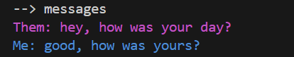

# ldr-cli-app

For tech-savvy long distance partners who want to stay connected on the fly, this small Python project allows two users to share messages and plan dates with each other all on the command line.


_


## Project Reasoning / Learning Outcomes

Why did I build this project? This project is my first time programming in Python. I wanted to learn a bit of Python due to the language's uses in many areas such as web development and scripting. Even though this is a small project, I've gotten my feet wet with Python's syntax and virtual environments so that I am ready to tackle further projects. Additionally, I learned to use Firebase for cloud storage and authenticaion. Since I was using Python as a frontend on the command line, I could not use Firebase's Python SDK because it is meant to be used on trusted backend servers. I needed users to authenticate on the command line, which the SDK doesn't support. Thus, I relied on Firebase's REST API to store and query data. This required a decent amount of documentation reading. However, it solidified my working knowledge of REST API's and HTTP Requests/Responses.

Additionally, as a CS student who is currently in a long distance relationship, this project fits my own use case and carries personal meaning to me. 

## Installation
Each user must complete this step of the install. Clone the repository and `cd` into it. Then, create the virtual environment with the name `.venv` and install dependencies:

```bash
python3 -m venv .venv
source .venv/bin/activate
pip install -r requirements.txt
```

One user must complete this step of the install. Create a Firebase project and create a database with its ID as (default). In the Authentication panel, under sign-in method, enable Email/Password as a provider. Then, under Users, add two users by giving email and password combinations. As a reminder, this project works for exactly two users and its behaviour is undefined if more users are added. In settings, in the User Actions panel, disable user sign-up. Go to the Firestore Database panel and under Indexes, add an index with collection ID as `dates` and add `date` and `event` as fields. Then, under Rules, add this security rule:

```plaintext
match /{document=**} {
    allow read, write: if request.auth != null;
}
```

In project settings, add a web app. Both users must copy the configuration object into `firebase_config.py` in their project directories.

Both users must complete the rest of the steps.

Create a `.env` file and add your email and password combination used for authentication:

```plaintext
EMAIL=fakeemail@gmail.com
PASSWORD=fakepassword123
```

Next, change the executable permissions of the two shell scripts by running `chmod +x (full path to the script)`

In the files `ldr.sh` and `cleanup.sh`, replace the target for the `cd` command with the absolute path to the project directory. Copy and rename the `ldr.sh` file as `ldr` into a directory in your PATH, so that you can run the app in your terminal from anywhere as `ldr`.

Setup a cron job to execute the cleanup script which deletes old messages and dates every day. Modify the crontab by running `crontab -e`. In the following line, change the path to the `cleanup.sh` file and specify a path to a log file. Append the line to the crontab.
```bash
0 0 * * * /home/jyang80/projects/ldr-cli-app/cleanup.sh >> /home/jyang80/myscript.log 2>&1
```


